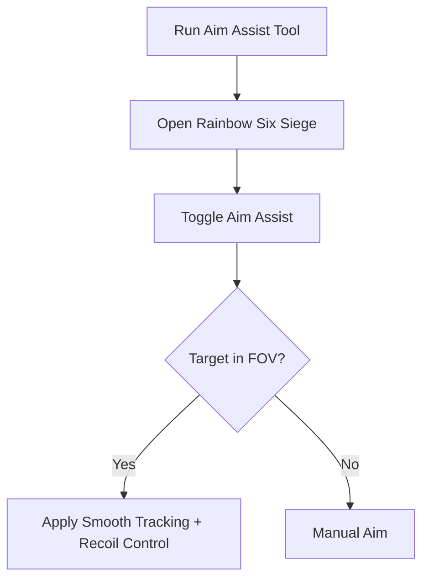

# Rainbow Six Siege Aim Assist 🎯

The **Rainbow Six Siege Aim Assist Software** is designed for players who want to sharpen their shooting mechanics in a controlled environment. With customizable configs, smooth tracking, and recoil adjustments, this tool makes practicing aim and weapon control easier than ever.

[](#)
[](#)
[](#)
[](#)

---

## 📝 Overview

Rainbow Six Siege demands split-second precision and recoil mastery. Aim assist provides **configurable lock-on, smooth movement curves, and per-weapon profiles**, giving you a way to **train aim, refine reflexes, and experiment with builds** without affecting your core saves.

\[!IMPORTANT]
This software is intended for **training and offline testing**. Online competitive use is not supported.

---

## ⭐ Features

* **Adjustable FOV Targeting** – Limit aim assist to a chosen radius for natural feel.
* **Smooth Tracking Curves** – Control how quickly crosshairs lock onto targets.
* **Recoil Compensation** – Reduce weapon kick for stable firing.
* **Weapon Profiles** – Save unique settings for rifles, SMGs, or snipers.
* **Hotkey Toggles** – Enable or disable instantly.
* **Overlay Indicators** – Visual FOV circles and aim assist status.

---

## 🖥 Compatibility

| Platform                | Supported | Notes             |
| ----------------------- | --------- | ----------------- |
| Windows 10/11           | ✅         | Full support      |
| Steam / Ubisoft Connect | ✅         | Stable builds     |
| Console (Xbox/PS)       | ❌         | Not supported     |
| Linux (Proton)          | ⚠️        | Experimental only |

\[!NOTE]
Accessibility: Visual overlays can be scaled and recolored for visibility across maps.

---

## ⚡ Setup Guide

1. **Download** the Aim Assist package.
2. Extract into your Rainbow Six Siege install directory.
3. Run `AimAssist.exe` as administrator.
4. Launch the game and press `F2` to toggle aim assist.
5. Edit `config.ini` to personalize your setup.

```ini
[aimassist]
fov=85
smooth=6
recoil_control=true
profile=rifle
hotkey=VK_XBUTTON2
```

---

## 🔄 Aim Assist Workflow



---

## ❓ FAQ

**Q: How is this different from an aimbot?**
A: Aim assist is smoother and more natural—helping track targets, not snapping instantly.

**Q: Can I save multiple configs?**
A: Yes, weapon-specific profiles are supported.

**Q: Does it impact FPS?**
A: Very minimal—optimized for background use.

**Q: Will this affect my saves?**
A: No, it only runs in memory during gameplay.

**Q: Can I disable recoil control?**
A: Yes, simply set `recoil_control=false` in your config.

---

## 🚀 Final Thoughts

The **Rainbow Six Siege Aim Assist Software** is a lightweight yet powerful way to **train accuracy, stabilize recoil, and sharpen reflexes**. With configs, overlays, and weapon profiles, it’s the perfect practice companion.

---


